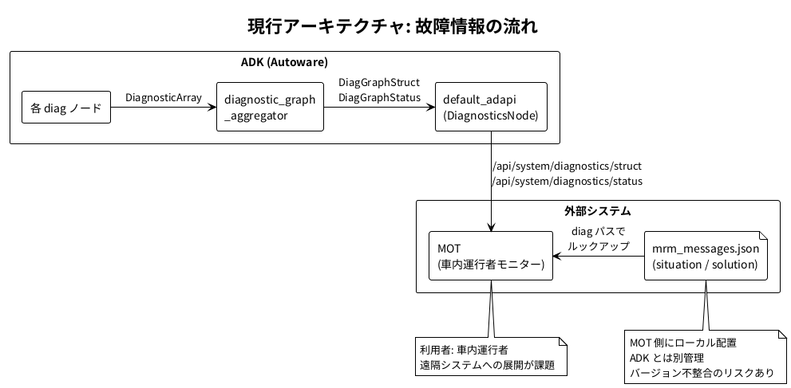
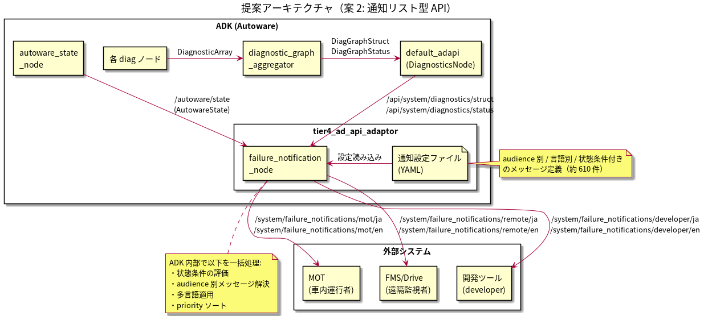
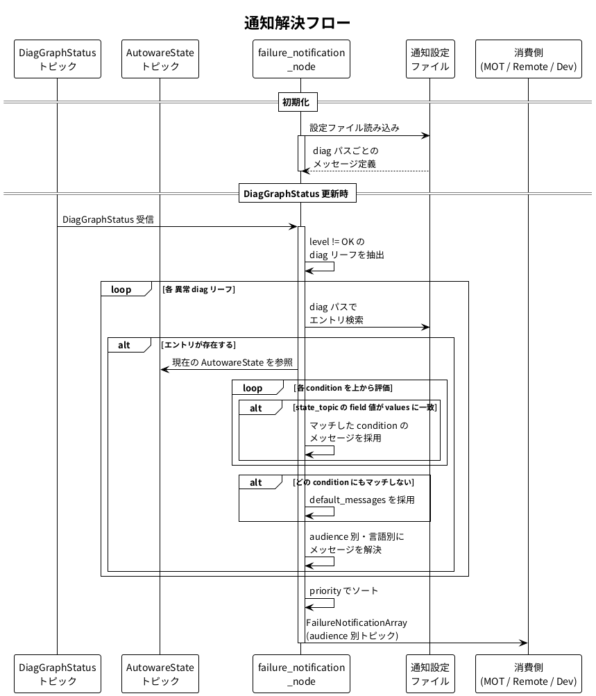

# 故障通知 API 設計たたき台

## 1. 背景・目的

### 1.1 現状

現在の ADK（Pilot.Auto X2 v4.3）では、故障診断情報を以下の 2 つの AD API として外部に公開している。

- `/api/system/diagnostics/struct` (DiagGraphStruct) — 診断グラフの静的構造（ノード・リーフ・リンク）
- `/api/system/diagnostics/status` (DiagGraphStatus) — 各ユニットの現在のレベル・メッセージ

MOT（車内運行者モニター）での故障表示は、上記の診断 API から得られる diag パスをキーとして、別途 MOT 側に配置された `mrm_messages.json` を参照し、situation（状況説明）・solution（対処方法）を画面に表示する方式をとっている。



### 1.2 課題

遠隔監視システム（FMS/Drive）など、自動運転システムとは独立したデプロイサイクルを持つ外部システムが増加する中で、以下の課題が顕在化している。

- **バージョン不整合**: 遠隔システムは ADK と異なるタイミングでアップデートされる。故障と文書を紐付ける JSON を外部システム側に持っていると、ADK のアップデートに伴い diag パスの変更・追加・削除が発生した際に、文書の不整合が起きる
- **実装の分散**: 各消費システム（MOT、遠隔、将来のシステム）がそれぞれ JSON のルックアップロジックを実装する必要がある
- **拡張の困難さ**: 多言語対応、対象システムに応じた文書差異、状態に応じた文言切り替えなどの要件を外部システム側で個別に実装するのは困難

### 1.3 目的

ADK 側から、故障時に表示すべき文書（situation / solution）を含めた通知情報を API として配信する仕組みを設計する。

## 2. 要件整理

### 2.1 機能要件

| # | 要件 | 詳細 |
|---|------|------|
| F-1 | audience 別文書対応 | 対象システム（audience）に応じて異なる situation / solution を配信する |
| F-2 | audience 拡張性 | audience は任意個に追加可能な設計とする。初期 audience として以下を想定: |
|     |                 | - `mot`: 車内運行者向け（操作指示中心） |
|     |                 | - `remote`: 遠隔監視者向け（指示・状況把握中心） |
|     |                 | - `developer`: 開発者向け（技術的詳細・トピック名・状態値等） |
| F-3 | 多言語対応 | 最低限、日本語（ja）と英語（en）を初期サポートする。言語の追加は設定ファイルの拡張で対応可能とする |
| F-4 | 状態条件による文言切り替え | 車両の状態に応じて、同じ diag パスでも異なる situation / solution を出力する。主に `/autoware/state`（AutowareState）を参照する。汎用的な条件指定（`state_topic` / `field` / `values`）により将来的に他のトピックも条件に追加可能 |
| F-5 | 優先度（priority） | 対応アクションの重要度に基づく priority を設定し、ソートして配信する。例: 「再起動してください」は「復帰操作をしてください」より高優先度 |

## 3. アプローチ比較

以下の 3 案を比較検討し、案 2 を推奨案として詳細設計を行う。

### 案 1: JSON 配信型（現行拡張）

ADK 側で `mrm_messages.json` 相当のマッピングテーブル全体を API トピックとして配信する。消費側は diag status とマッピングテーブルを突合して表示を行う。

| 観点 | 評価 |
|------|------|
| **Pros** | |
| 移行コスト | 現行 MOT の仕組みに最も近く、移行コストが小さい |
| 消費側柔軟性 | フィルタリング・表示方法を消費側に委ねることができる |
| **Cons** | |
| 解釈ロジックの分散 | 消費側にルックアップ + 状態条件判定 + audience フィルタ等の解釈ロジックの実装が必要。JSON の所在（ADK から配信）は解決するが、解釈ロジックの実装が消費側ごとに必要であり、そのロジックのバージョン不整合リスクは残る |
| 実装負荷 | audience 別・状態条件による文言切り替えロジックが各消費側に分散し、実装負荷が高い |

### 案 2: 通知リスト型 API（推奨）

ADK 内部で diag 状態 + 車両状態を突合し、解決済みの通知リスト（priority 付き、audience 別、言語別の situation / solution）を API として配信する。消費側はリストをそのまま表示するだけでよい。

| 観点 | 評価 |
|------|------|
| **Pros** | |
| 消費側の簡素さ | 受け取ったリストをそのまま表示するだけでよく、消費側の実装が最もシンプル |
| バージョン整合 | 状態条件の判定・audience 別メッセージ解決・優先度ソートがすべて ADK 側で完結し、バージョン不整合を根本的に解決 |
| 拡張性 | 多言語・対象システム拡張も ADK 側の設定変更で完結 |
| 帯域効率 | 表示されるべき情報だけが配信されるため効率がよい |
| **Cons** | |
| 開発コスト | 新規 API + 新規ノードの開発が必要 |
| 設定管理 | ADK 側にメッセージ解決の設定ファイル管理が増える |

### 案 3: 拡張診断グラフ型

既存の `DiagGraphStatus` メッセージを拡張し、各 diag ノードに situation / solution 等の文書情報を埋め込む。

| 観点 | 評価 |
|------|------|
| **Pros** | |
| 後方互換性 | 既存 API の自然な拡張で後方互換性を保ちやすい |
| コンテキスト保持 | diag の tree 構造と文書が一体化するためコンテキストが保持される |
| **Cons** | |
| メッセージサイズ | DiagGraphStatus は OK のものも含む全ノードのステータスを送信しているため、全ノード x 全 audience x 全言語でメッセージサイズが大幅に増加する |
| ADAPI 影響 | ADAPI 仕様への影響が大きく、Pilot.Auto X2 スコープを超える可能性がある |
| 消費側の負荷 | audience 別の内容差異や priority 付きソートを消費側が行う必要がある |

### 比較まとめ

| 評価軸 | 案 1: JSON 配信型 | 案 2: 通知リスト型 | 案 3: 拡張診断グラフ型 |
|--------|:-:|:-:|:-:|
| バージョン不整合の解決 | △ | ◎ | △ |
| 消費側の実装負荷 | × | ◎ | × |
| 多言語・audience 拡張性 | △ | ◎ | △ |
| 既存 API への影響 | ○ | ◎ | × |
| 開発コスト | ◎ | ○ | ○ |
| 帯域効率 | × | ◎ | × |

**結論: 案 2（通知リスト型 API）を推奨案として採用する。**

## 4. 推奨案（案 2）の詳細設計

### 4.1 アーキテクチャ

新規ノード `failure_notification_node` を `tier4_ad_api_adaptor` 配下に追加する。



**Subscribe するトピック:**

| トピック | メッセージ型 | 用途 |
|---------|-------------|------|
| `/api/system/diagnostics/struct` | `DiagGraphStruct` | diag パスの取得（静的構造） |
| `/api/system/diagnostics/status` | `DiagGraphStatus` | 各 diag ユニットの現在の状態 |
| `/autoware/state` | `AutowareState` | 車両の統合状態（状態条件の評価に使用） |

設定ファイルの `state_topic` / `field` / `values` による汎用条件指定を採用しているため、将来的に `/autoware/state` 以外のトピックも条件に追加可能。

**Publish するトピック:**

| トピック | メッセージ型 | QoS | 用途 |
|---------|-------------|-----|------|
| `/system/failure_notifications` | `FailureNotificationArray` | best_effort | audience / 言語ごとの通知リスト |

### 4.2 メッセージ型

```
# FailureNotification.msg
string diag_path       # 対応する diag のパス（例: "/localization/001-topic_status/initialpose"）
string error_code      # エラーコード（例: "LOC-00-E00-001E"）
uint8 diag_level       # 元の diag level (OK=0 / WARN=1 / ERROR=2 / STALE=3)
uint32 priority        # 表示優先度（数値が小さいほど高優先）
string situation       # 状況説明文（状態条件・言語適用済み）
string solution        # 対処方法（状態条件・言語適用済み）
```

```
# FailureNotificationArray.msg
builtin_interfaces/Time stamp
FailureNotification[] notifications  # priority 順にソート済み
```

### 4.3 設定ファイル形式

現行の `mrm_messages.json` を拡張した YAML 形式。audience 別・言語別・状態条件付きのメッセージ定義を行う。

```yaml
notifications:
  "/localization/001-topic_status/initialpose":
    error_code: "LOC-00-E00-001"
    priority: 100
    conditions:
      # AutowareState = WAITING_FOR_ROUTE のとき: ルート未設定用のメッセージ
      - state_topic: "/autoware/state"
        field: "state"
        values: [2]
        messages:
          mot:
            ja:
              situation: "ルートが引かれていません"
              solution: "ルートを設定してください"
            en:
              situation: "Route is not set"
              solution: "Please set a route"
          remote:
            ja:
              situation: "ルート未設定です"
              solution: "運行者にルート設定を指示してください"
            en:
              situation: "Route is not set"
              solution: "Please instruct the operator to set a route"
          developer:
            ja:
              situation: "RouteState=UNSET: ルート未設定"
              solution: "/api/routing/set_route でルートを設定"
            en:
              situation: "RouteState=UNSET: route not set"
              solution: "Set route via /api/routing/set_route"
      # AutowareState = PLANNING〜ARRIVED_GOAL のとき: 通常の故障メッセージ
      - state_topic: "/autoware/state"
        field: "state"
        values: [3, 4, 5, 6]
        messages:
          mot:
            ja:
              situation: "初期位置推定が完了していません"
              solution: "自己位置推定の完了を待ってください"
            en:
              situation: "Initial pose estimation is not complete"
              solution: "Please wait for localization to complete"
          remote:
            ja:
              situation: "初期位置推定が完了していません"
              solution: "自己位置推定完了をお待ちください"
            en:
              situation: "Initial pose estimation is not complete"
              solution: "Please wait for localization to complete"
          developer:
            ja:
              situation: "LocalizationState!=INITIALIZED: 初期位置推定未完了"
              solution: "initialpose を設定するか NDT の収束を待つ"
            en:
              situation: "LocalizationState!=INITIALIZED: initial pose not set"
              solution: "Set initialpose or wait for NDT convergence"
    # どの条件にもマッチしない場合のフォールバック
    default_messages:
      mot:
        ja:
          situation: "初期位置推定が完了していません"
          solution: "自己位置推定の完了を待ってください"
        en:
          situation: "Initial pose estimation is not complete"
          solution: "Please wait for localization to complete"
```

**設定ファイルの解釈ルール:**

1. diag パスに対応するエントリの `conditions` を上から順に評価する
2. `state_topic` で指定されたトピックの `field` フィールドの値が `values` のいずれかに一致すれば、その condition のメッセージを採用する
3. どの condition にもマッチしない場合は `default_messages` を使用する
4. `default_messages` にも該当 audience / 言語がない場合は通知を出さない（非表示）

### 4.4 通知解決フロー



`failure_notification_node` は以下のフローで通知リストを生成する:

1. `DiagGraphStatus` の更新を受信するたびに処理を実行
2. 各 diag リーフの `level` が OK 以外（WARN / ERROR / STALE）のものを抽出。ただし、diag が OK に復帰したがラッチ状態（MRM 介入等により復帰操作が必要な状態）が解除されていない場合は、故障メッセージではなく復帰操作の通知（例: 「復帰ボタンを押してください」）を配信する
3. diag パスをキーとして設定ファイルのエントリを検索
4. 現在の `/autoware/state` の値と `conditions` を照合し、適用するメッセージを決定
5. 設定された audience と言語の全組み合わせについてメッセージを解決
6. priority でソートし、`FailureNotificationArray` として publish

### 4.5 配信方式

| 方式 | Pros | Cons |
|------|------|------|
| **audience ごとに別トピック** (`/system/failure_notifications/mot`, `/system/failure_notifications/remote` 等) | 消費側は自分のトピックだけ subscribe すればよい。不要なデータを受信しない | トピック数が audience x 言語で増加する可能性がある |
| **単一トピックに audience フィールドを含める** | トピック管理がシンプル | 消費側で不要な audience のメッセージもフィルタリングする必要がある |

推奨: **audience / 言語ごとに別トピック** を採用する。消費側のシンプルさを重視し、不要なデータの受信を避ける。

トピック名の構造:

```
/system/failure_notifications/<audience>/<language>
```

具体例:

| トピック | 用途 |
|---------|------|
| `/system/failure_notifications/mot/ja` | MOT 向け・日本語 |
| `/system/failure_notifications/mot/en` | MOT 向け・英語 |
| `/system/failure_notifications/remote/ja` | 遠隔監視向け・日本語 |
| `/system/failure_notifications/remote/en` | 遠隔監視向け・英語 |
| `/system/failure_notifications/developer/ja` | 開発者向け・日本語 |
| `/system/failure_notifications/developer/en` | 開発者向け・英語 |

`audience` と `language` はトピック名自体に含まれるため、`FailureNotificationArray` メッセージ型にはこれらのフィールドを持たない。ノードのパラメータで配信する audience / 言語の組み合わせを指定する（デフォルト: 全組み合わせ）。

### 4.6 既存システムとの関係

- 既存の `diagnostics/struct` / `diagnostics/status` API はそのまま維持（変更なし）

## 5. 現行 mrm_messages.json からの移行

### 5.1 現行フォーマットとの対応

| 現行 mrm_messages.json | 新設定ファイル |
|------------------------|---------------|
| キー（diag パス） | `notifications` の第一階層キー |
| `ERROR` / `default` ブロック | `diag_level` に応じた条件として設定可能（将来拡張） |
| `situation` | `messages.<audience>.<lang>.situation` |
| `solution` | `messages.<audience>.<lang>.solution` |
| `error_code` | `error_code` |
| `initialization_state_condition` | `conditions` の `state_topic: "/autoware/state"` で表現 |
| `routing_state_condition` | `conditions` の `state_topic: "/autoware/state"` で表現 |
