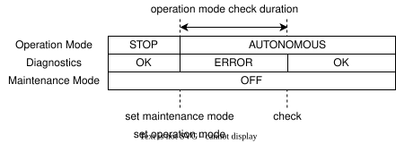

# Maintenance Mode API

## 概要

このAPIはソフトウェア更新などメンテナンス作業を行っている際に誤って車両が発進しないようメンテナンス状態の管理を行う。

## 前提

- メンテナンス作業によりソフトウェアが再起動される可能性があるため[maintenance-state-store](https://github.com/tier4/maintenance-state-store)により状態の永続化を行う。
- 出力する診断情報がERRORになった場合に車両がMRMを実施するよう、停止モード以外を禁止するように診断ツリーの設定を行う。

## 要件

- メンテナンス状態として三状態(UNKNOWN, ON, OFF)を管理する
- メンテナンス状態を取得を行うAPIを提供する。
- メンテナンス状態の変更を行うAPIを提供する。
- メンテナンス状態の変更はメンテナンス状態がUNKNOWNの場合は常に禁止する。
- メンテナンス状態の変更は車両が停止モードのときのみに限定する。
- メンテナンス状態がOFFではない場合：
  - 車両が停止モードのとき、停止モード以外への遷移を禁止する。
  - 車両が停止モードではないとき、車両を停止させる。

## 設計

現在のメンテナンス状態を読み取り、OFF以外であれば診断情報をERRORとして出力する。この診断情報を診断ツリーに紐付けることでモードの遷移を禁止する。
また、もし何らかの理由で走行中にメンテナンス状態がONになった場合も診断ツリーの設定によりMRMが起動される。

メンテナンス状態は走行中を管理しないため、メンテナンス状態と車両モードが同時に変更された場合に互いのチェックが同期しない可能性がある。
そのためメンテナンス状態をONにする場合、事前に車両のモード変更を禁止し、一定時間後にモードの変更が行われていなければメンテナンス状態の変更を実施するものとする。

メンテナンス状態ONの要求にオペレーションモード変更が割り込んだ場合、モードの再チェックタイミングで処理をキャンセルし、モード変更の禁止も解除する。

