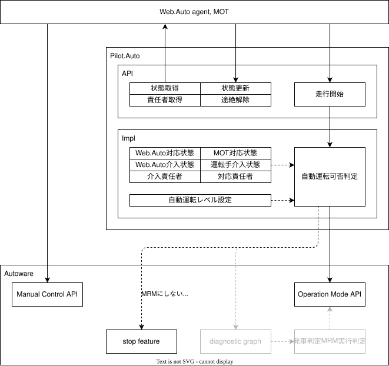
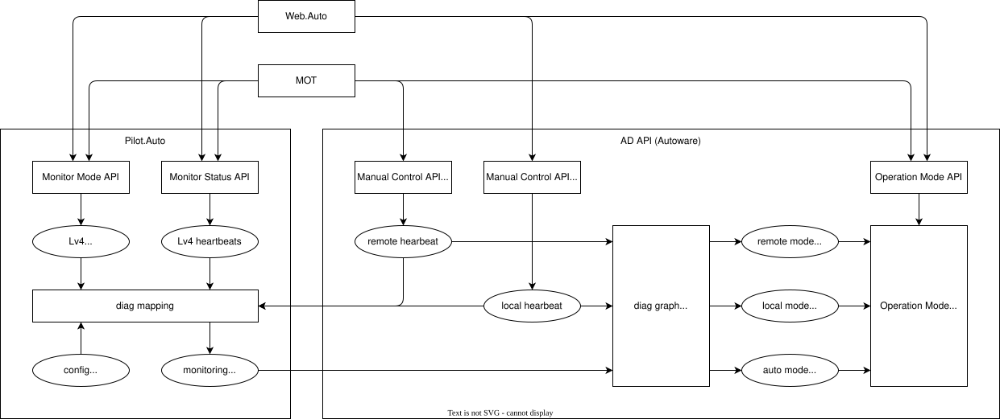

# Monitoring API

## オペレーター種別

### 介入オペレーター

動的運転タスクの一部または全てについて責任を持った状態で車両を制御することのできるオペレーターを指す。
該当する動的運転タスクに必要な情報を直接的または間接的に観測し、車両装置または中継機能を用いて車両を制御する。
本機能では以下のオペレーターを想定しており、各オペレーター毎に以下のいずれかの状態を持つものとする。

- 運転手
- 車内介入オペレーター
- 遠隔介入オペレーター

| 状態           | 説明                                                                               |
| -------------- | ---------------------------------------------------------------------------------- |
| 介入実施       | 責任を持つタスクを直接実施している状態。全タスクが対象の場合これは手動運転となる。 |
| 介入監視       | 責任を持つタスクをAutowareが実施しているが、即座に介入できるよう監視している状態。 |
| 介入待機(参考) | 責任を持つタスクをAutowareが実施しており、Autowareから要求があれば引き継げる状態。 |
| 介入不可       | 介入オペレーターの準備ができていない状態。                                         |
| 通信途絶       | 介入オペレーターとの通信途絶を検知した状態。管理上の状態で直接指定することはない。 |

### 対応オペレーター

運行設計領域から外れた場合など、前提条件を満たさなくなった際にAutowareへ対応方針を指示できるオペレーターを指す。
動的運転タスクについてはAutowareが責任を持った状態で動作し、Autowareは指示された対応方針にしたがって車両を制御する。
本機能では以下のオペレーターを想定しており、各オペレーター毎に以下のいずれかの状態を持つものとする。

- 車内対応オペレーター
- 遠隔対応オペレーター

| 状態     | 説明                                                                               |
| -------- | ---------------------------------------------------------------------------------- |
| 対応実施 | Autowareに向けて指示を出している状態。                                             |
| 対応待機 | Autowareに向けて必要があれば指示を出せる状態。                                     |
| 対応不可 | 対応オペレーターの準備ができていない状態。                                         |
| 通信途絶 | 対応オペレーターとの通信途絶を検知した状態。管理上の状態で直接指定することはない。 |

## オペレーター割当

車両に対して複数のオペレーターを割り当てることができるが、特定の状態にあるオペレーターは排他管理されていなければならない。
管理上の概念として以下の枠を設定し、ここに割り当てられるオペレーターを以下の仕組みにより選出する。
本機能ではオペレーター優先度は運転手、車内、遠隔の順に高く設定されているものとする。

- 介入責任者：介入実施状態または介入監視状態であるオペレーターの中で最も優先度の高い介入オペレーター。
- 対応責任者：対応実施状態であるオペレーターの中で最も優先度の高い対応オペレーター。

また、接続しているオペレーターの中で特定の状態にあるオペレーターの集合を以下のように定義する。

- 介入待機者：介入不可状態または通信途絶状態ではない介入オペレーター。
- 対応待機者：対応不可状態または通信途絶状態ではない対応オペレーター。

## 車両設定

車両には自動運転に必要な条件として以下の設定が存在しており、設定に応じて自動運転を開始できるか判定が行われる。

| 条件              | 説明                   |
| ----------------- | ---------------------- |
| Lv2自動運転       | 介入責任者が存在する。 |
| Lv3自動運転(参考) | 介入待機者が存在する。 |
| Lv4自動運転       | 対応待機者が存在する。 |

## 車両側要件

- 車両は各オペレーターの状態管理を行う。
  - 車両は各オペレーターから状態を受け取り、受信状態としてそれを保持する。
  - 車両は各オペレーターとの通信が途絶した場合、途絶状態を有効にする。
  - 車両は各オペレーターから途絶解除を要求された場合、途絶状態を無効にする。
  - 車両は各オペレーターの状態について、途絶状態が有効の場合は通信途絶として扱う。
  - 車両は各オペレーターの受信状態と途絶状態をオペレーターに対して通知する。
- 車両は介入責任者と対応責任者を決定する。
  - 車両は介入責任者が存在しないか唯一となるようにオペレーターを割り当てる。
  - 車両は対応責任者が存在しないか唯一となるようにオペレーターを割り当てる。
  - 車両は現在の介入責任者と対応責任者をオペレーターに対して通知する。
- 車両は要求する自動運転レベルに従って動作を変更する。
  - 車両は要求する自動運転レベルがLv2とLv4のどちらであるか管理する。
  - 車両は要求する自動運転レベルについてオペレーターに通知する。
  - 車両がLv2に設定されている場合、介入責任者が存在する場合に自動運転可能と定義する。
  - 車両がLv4に設定されている場合、対応待機者が存在する場合に自動運転可能と定義する。
  - 車両が自動運転可能ではない場合、自動運転状態になければ自動運転の開始要求を拒否する。
  - 車両が自動運転可能ではない場合、自動運転状態であれば緩減速により停止し、自動運転状態を解除する。
  - 車両がLv2に設定されている場合、介入責任者以外による介入操作を異常として無視する。
  - 車両がLv4に設定されている場合、対応責任者以外による対応指示を異常として無視する。
  - 必要に応じて以下の要件を追加しても良い
    - 車両が自動運転状態になく停止している場合、要求する自動運転レベルを変更できる。
    - 車両がLv2に設定されている場合、事前に定めた介入オペレーターのみを介入責任者として設定する。
    - 車両がLv2に設定されている場合、事前に定めた介入オペレーター以外が存在すれば異常とする。
    - 車両がLv2に設定されている場合、許可していない対応オペレーターが存在すれば異常とする。
    - 車両がLv4に設定されている場合、許可していない介入オペレーターが存在すれば異常とする。

## 監視側要件

- 介入実施状態についてはAD APIのManual Control APIを使用する。
  - 本機能とは別に初期設定と専用のハートビードとコマンドの送信が必要となる。
- 介入責任者に選ばれていない場合、介入実施状態になってはいけない。
- 対応責任者に選ばれていない場合、対応実施状態になってはいけない。

## 全体図(3層)



## 全体図(2層)



## インターフェース

### /api/external/set/operation/mode

```txt
# SetOperationMode.srv

uint8 STOP=1
uint8 LV2=2
uint8 LV4=3

uint8 mode
---
ResponseStatus status
```

### /api/external/set/operation/available

```txt
# OperationAvailable.msg

builtin_interfaces/Time stamp
bool lv2
bool lv4
```

### /api/external/set/monitoring/supervisor/heartbeat

```txt
# SupervisorHeartbeat.msg

uint8 UNAVAILABLE
uint8 AVAILABLE
uint8 EXCLUSIVE

builtin_interfaces/Time stamp
uint8 id
uint8 status
```

### /api/external/get/monitoring/supervisor/status

```txt
# SupervisorStatus.msg

builtin_interfaces/Time stamp
uint8 responsible
SupervisorStatus[] list
    uint8 id
    uint8 status
    bool timeout
```

### /api/external/set/monitoring/supervisor/timeout/reset

```txt
# ResetSupervisorTimeout.msg

uint8 id
---
ResponseStatus status
```

### その他

定数など一部が異なるだけで基本的に構造は同じ

- /api/external/set/monitoring/advisor/heartbeat
- /api/external/get/monitoring/advisor/status
- /api/external/set/monitoring/advisor/timeout/reset
