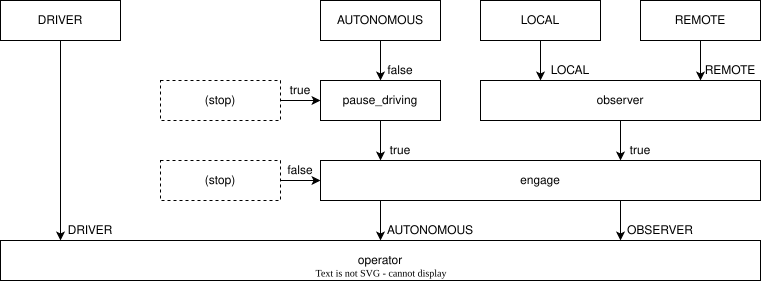
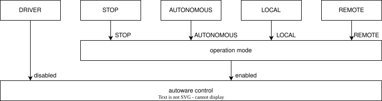
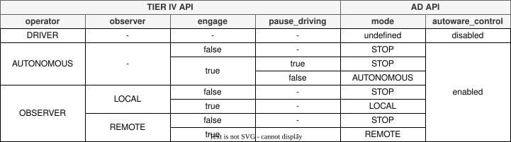

# Migrate to Operation Mode API

## 構成（TIER IV API）

TIER IV APIにおけるOperation Modeは、以下のような２つの入力セレクター（operatorとobserver）と、２つのフィルター（pause_drivingとengage）からなる構成に基づいて設計されている。
Engageフィルターは車両の直接操作時（DRIVER）以外では常に適用され、falseの場合にコマンドを停止で上書きする効果を持つ。もう一方のpause_drivingフィルターはAUTONOMOUSのみが対象で、trueの場合に車両の最高速度を 0 km/h に設定することで車両を停止させている。

## 構成（AD API）

AD APIでは、フィルターによる停止コマンドへの上書きは廃止され、代わりにSTOPモードからの入力という形でセレクターに処理が統合された。
全体では以下のような２つの入力セレクター（operation modeとautoware control）による構成に変更されている。
DRIVERのみがAutowareを使用せず車両を直接制御している状態であるため、この部分をautoware controlとして分離し、残りをAutoware制御下でのoperation modeの切り替えとしている。
詳細は[Operation mode API](https://autowarefoundation.github.io/autoware-documentation/main/design/autoware-architecture-v1/interfaces/ad-api/features/operation_mode/)を参照のこと。

## ステート対応表

以下にTIER IV APIとAD API のステートの対応表を示す。車両の直接制御を切り替える場合のみautoware controlを操作し、それ以外の場合にはoperation modeを操作する。

