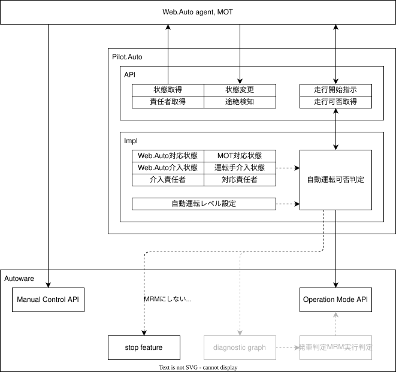

# Monitoring API

## インターフェース

- [走行状態通知](../api/driving-status.md)
- [走行状態変更](../api/driving-enable.md)
- [監視オペレーター状態通知](../api/supervisor-status.md)
- [監視オペレーター状態変更](../api/supervisor-change.md)
- [監視オペレーター途絶検知](../api/supervisor-heartbeat.md)
- [助言オペレーター状態通知](../api/advisor-status.md)
- [助言オペレーター状態変更](../api/advisor-change.md)
- [助言オペレーター途絶検知](../api/advisor-heartbeat.md)

### 監視オペレーター

動的運転タスクの一部または全てについて責任を持った状態で車両を制御することのできるオペレーターを指す。
該当する動的運転タスクに必要な情報を直接的または間接的に観測し、車両装置または中継機能を用いて車両を制御する。
本機能では以下のオペレーターを想定しており、各オペレーター毎に以下のいずれかの状態を持つものとする。
なお、本機能を実現する上では介入実施と監視実施を区別する必要がないため、まとめて監視実施状態として扱う。

- 車内監視オペレーター
- 遠隔監視オペレーター

| 状態           | 説明                                                                               |
| -------------- | ---------------------------------------------------------------------------------- |
| 介入実施(参考) | 責任を持つタスクを直接実施している状態。全タスクが対象の場合これは手動運転となる。 |
| 監視実施       | 責任を持つタスクをAutowareが実施しているが、即座に監視できるよう監視している状態。 |
| 監視待機       | 責任を持つタスクをAutowareが実施しており、Autowareから要求があれば引き継げる状態。 |
| 監視不可       | 監視オペレーターの準備ができていない状態。                                         |
| 通信途絶       | 監視オペレーターとの通信途絶を検知した状態。管理上の状態で直接指定することはない。 |

### 助言オペレーター

運行設計領域から外れた場合など、前提条件を満たさなくなった際にAutowareへ助言方針を指示できるオペレーターを指す。
動的運転タスクについてはAutowareが責任を持った状態で動作し、Autowareは指示された助言方針にしたがって車両を制御する。
本機能では以下のオペレーターを想定しており、各オペレーター毎に以下のいずれかの状態を持つものとする。

- 車内助言オペレーター
- 遠隔助言オペレーター

| 状態     | 説明                                                                               |
| -------- | ---------------------------------------------------------------------------------- |
| 助言実施 | Autowareに向けて指示を出している状態。                                             |
| 助言待機 | Autowareに向けて必要があれば指示を出せる状態。                                     |
| 助言不可 | 助言オペレーターの準備ができていない状態。                                         |
| 通信途絶 | 助言オペレーターとの通信途絶を検知した状態。管理上の状態で直接指定することはない。 |

## オペレーター割当

車両に対して複数のオペレーターを割り当てることができるが、特定の状態にあるオペレーターは排他管理されていなければならない。
これは複数のオペレーターが同時に操作を行ってしまい指示が混在することを防ぐためである。
管理上の概念として以下の枠を設定し、ここに割り当てられるオペレーターを以下の仕組みにより選出する。
本機能ではオペレーター優先度は車内、遠隔の順に高く設定されているものとする。

- 監視責任者：監視実施状態であるオペレーターの中で最も優先度の高い監視オペレーター。
- 助言責任者：助言実施状態であるオペレーターの中で最も優先度の高い助言オペレーター。

また、接続しているオペレーターの中で特定の状態にあるオペレーターの集合を以下のように定義する。

- 監視待機者：監視実施状態または監視待機状態である監視オペレーター。
- 助言待機者：助言実施状態または助言待機状態である助言オペレーター。

## 車両設定

車両には自動運転に必要な条件として以下の設定が存在しており、設定に応じて自動運転を開始できるか判定が行われる。

| 条件              | 説明                   |
| ----------------- | ---------------------- |
| Lv2自動運転       | 監視責任者が存在する。 |
| Lv3自動運転(参考) | 監視待機者が存在する。 |
| Lv4自動運転       | 助言待機者が存在する。 |

## 車両側要件

- 車両は各オペレーターの状態管理を行う。
  - 車両は各オペレーターから要求を受け取り、受信状態を該当状態にする。
  - 車両は各オペレーターとの通信が途絶した場合、受信状態を途絶状態にする。
  - 車両は各オペレーターの受信状態をオペレーターに対して通知する。
- 車両は監視責任者と助言責任者を決定する。
  - 車両は監視責任者が存在しないか唯一となるようにオペレーターを割り当てる。
  - 車両は助言責任者が存在しないか唯一となるようにオペレーターを割り当てる。
  - 車両は監視責任者と助言責任者に選ばれているかを各オペレーターに対して通知する。
- 車両は要求する自動運転レベルに従って動作を変更する。
  - 車両は要求する自動運転レベルがLv2とLv4のどちらであるか管理する。
  - 車両は要求する自動運転レベルについてオペレーターに通知する。
  - 車両がLv2に設定されている場合、監視責任者が存在する場合に自動運転可能と定義する。
  - 車両がLv4に設定されている場合、助言待機者が存在する場合に自動運転可能と定義する。
  - 車両が自動運転可能ではない場合、自動運転状態になければ自動運転の開始要求を拒否する。
  - 車両が自動運転可能ではない場合、自動運転状態であれば緩減速により停止し、自動運転状態を解除する。
  - 車両がLv2に設定されている場合、監視責任者以外による監視操作を異常として無視する。
  - 車両がLv4に設定されている場合、助言責任者以外による助言指示を異常として無視する。
  - 必要に応じて以下の要件を追加しても良い
    - 車両が自動運転状態になく停止している場合、要求する自動運転レベルを変更できる。
    - 車両がLv2に設定されている場合、事前に定めた監視オペレーターのみを監視責任者として設定する。
    - 車両がLv2に設定されている場合、事前に定めた監視オペレーター以外が存在すれば異常とする。
    - 車両がLv2に設定されている場合、許可していない助言オペレーターが存在すれば異常とする。
    - 車両がLv4に設定されている場合、許可していない監視オペレーターが存在すれば異常とする。

## 監視側要件

- 監視実施状態についてはAD APIのManual Control APIを使用する。
  - 本機能とは別に初期設定と専用のハートビードとコマンドの送信が必要となる。
- 監視責任者に選ばれていない場合、監視実施状態になってはいけない。
- 助言責任者に選ばれていない場合、助言実施状態になってはいけない。

## 全体図

